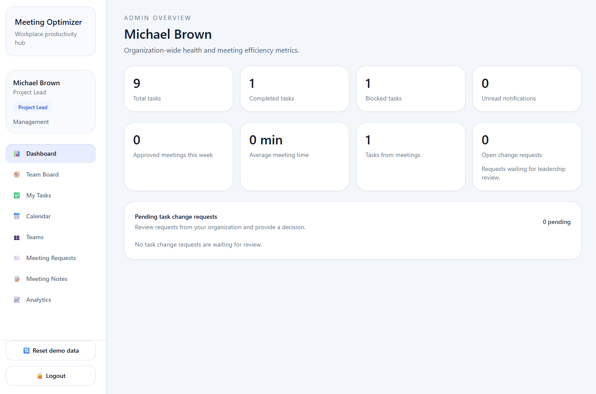
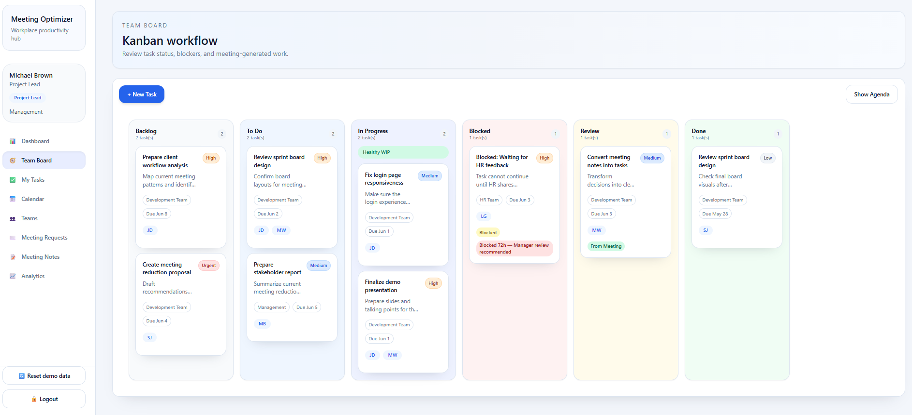

# Consulting Meeting Optimizer

Consulting Meeting Optimizer is a role-based project management and meeting coordination application built with React and Vite. It centralizes task management, meeting approval workflows, workload visibility and team collaboration into a single interface designed for consulting teams.

The project demonstrates frontend architecture, state management, role-based permissions and business workflow implementation through a realistic consulting environment.

## Preview

### Dashboard



### Task Board



### Meeting Requests


## Features

- Role-based access control
- Drag-and-drop Kanban task board
- Work-in-progress (WIP) limits
- Intelligent task assignment suggestions
- Meeting request approval workflow
- Meeting notes and action item tracking
- Calendar overview
- Team workload visualization
- Analytics dashboard
- Responsive desktop and mobile interface
- Local data persistence for demonstration purposes

## User Roles

The application supports four user roles with different permissions:

| Role | Responsibilities |
|------|------------------|
| Administrator | Full application management and oversight |
| Project Lead | Project supervision, approvals and reporting |
| Team Lead | Team coordination and meeting management |
| Team Member | Task execution and personal workload management |

## Technology Stack

- React
- JavaScript (ES Modules)
- Vite
- Tailwind CSS
- React Context API
- @hello-pangea/dnd
- Local Storage

## Project Structure

```text
src/
├── components/
│   ├── FocusMode/
│   ├── Layout/
│   ├── Tasks/
│   └── shared/
├── context/
├── data/
├── pages/
├── utils/
├── App.jsx
├── index.css
└── main.jsx
```

## Getting Started

### Clone the repository

```bash
git clone https://github.com/eddashkurti/consulting-meeting-optimizer.git
```

### Install dependencies

```bash
npm install
```

### Start the development server

```bash
npm run dev
```

### Build for production

```bash
npm run build
```

### Preview the production build

```bash
npm run preview
```

## Demo Environment

The application uses mock organizational data and simulated authentication.

User roles are provided for demonstration purposes, allowing different workflows and permissions to be explored without requiring a backend service.

Application data is stored locally using the browser's Local Storage.

## Application Workflow

1. Authenticate using one of the available demo roles.
2. View personal and team dashboards.
3. Create, assign and manage tasks through the Kanban board.
4. Monitor workload using WIP limits and analytics.
5. Submit meeting requests.
6. Approve or reject meetings based on user permissions.
7. Record meeting notes and generate follow-up actions.

## Future Improvements

- Backend API integration
- Database persistence
- Secure authentication
- Real-time collaboration
- Email and calendar integration
- Notifications and reminders
- AI-assisted meeting scheduling
- Docker deployment

## Author

**Edda Shkurti**

GitHub: https://github.com/eddashkurti

## License

This project is licensed under the MIT License.